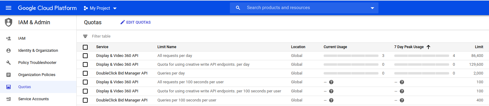

# DV360 Proxy

This solution acts as a proxy to access DV360 reports without giving direct access to DV360 API.
It solves three tasks:
- Whitelists advertisers allowed to access
- Blacklist metrics not allowed to access
- Log of requests made

Except of this is acts as a proxy, with no modification of requests and responses.

Table of Contents
=================

   * [DV360 Proxy](#dv360-proxy)
   * [Table of Contents](#table-of-contents)
   * [API Reference](#api-reference)
   * [Configuration](#configuration)
      * [Access to DV360 API](#access-to-dv360-api)
      * [Allowed Partners, Advertisers and blacklisted metrics](#allowed-partners-advertisers-and-blacklisted-metrics)
   * [Deployment](#deployment)
      * [Serverless Application Model](#serverless-application-model)
      * [Terraform](#terraform)
      * [Testing](#testing)
      * [Updates](#updates)
      * [API Limits](#api-limits)


# API Reference

Solution exposes Lambda function, that needs to be invoked directly using `lambda:InvokeFunction` API. There is built-in possibility to allow external AWS account to call the Lambda function.

Lambda receives request, validates it against allowed Advertisers and Metrics and invokes corresponding DV360 API. The proxy uses [v1.1 DBM API](https://developers.google.com/bid-manager/v1.1) and exposes query-related methods.

Request object structure is the following:

```
{
  "operation": apiOperation,
  "arguments": operationArguments
  }
}
```

`apiOperation` is one of:
* `getQueries`
* `getQuery`
* `createQuery`
* `runQuery`
* `deleteQuery`
* `getQueryReports`

`operationArguments` are different for different operations

| Operation     | Arguments           |
| ------------- |-------------|
| `getQueries`      | `{ pageToken }` |
| `getQuery`      | `{ queryId }`      |
| `createQuery` | `{ query }` format defined at https://developers.google.com/bid-manager/v1.1/queries#resource      |
| `runQuery` | `{ queryId, data }` format defined at https://developers.google.com/bid-manager/v1.1/queries/runquery#request-body      |
| `deleteQuery` | `{ queryId }` |
| `getQueryReports` | `{ queryId, pageToken }` |

Example:
```json
{
  "operation": "createQuery",
  "arguments": {
    "query": {
      "kind": "doubleclickbidmanager#query",
      "metadata": {
        "title": "Test",
        "dataRange": "CURRENT_DAY",
        "format": "CSV",
        "locale": "en"
      },
      "params": {
        "type": "TYPE_GENERAL",
        "groupBys": [
          "FILTER_ADVERTISER",
          "FILTER_LINE_ITEM"
        ],
        "filters": [{
          "type": "FILTER_ADVERTISER",
          "value": "1"
        }],
        "metrics": [
          "METRIC_IMPRESSIONS"
        ]
      },
      "schedule": {
        "frequency": "ONE_TIME"
      },
      "timezoneCode": "UTC"
    }
  }

}
```


# Configuration

> Configuration & Deployment may look complicated. In fact is very fast process taking up to 15 minutes if you have configured AWS CLI and Terraform (or AWS SAM). Checkout the demo below
[](http://www.youtube.com/watch?v=FJASgXdOZBE "DV360 installation demo")


DV360Proxy needs two configuration parameters:
* API Credentials of Service Account to acces DV360 API
* Configuration for the proxy, that has information about what partners and advertisers can be queried and blacklisted metrics for every advertiser

Parameters are stored in [AWS Systems Manager Parameter Store](https://docs.aws.amazon.com/systems-manager/latest/userguide/systems-manager-parameter-store.html).

Parameters have default names:
* `dv360proxy.credentials` (SecureString)
* `dv360proxy.config` (String)

Parameter names are passed to Lambda function through environment variables `API_CREDENTIALS_PARAMETER_NAME` and `CONFIG_PARAMETER_NAME` correspondingly.

You need to create these parameters manually in AWS Console or through API. Read in greater details below

_In CLI examples we don't pass AWS credentials, you should do it accordingly to your practices. We recommend to check out [@apr/ssts](https://www.npmjs.com/package/@apr/ssts) that simplify working with Bastion account approach and MFA._


## Access to DV360 API

DV360 uses Service Account model for accessing DV360 API. The flow is:
1. Create new Google Cloud Application that uses DisplayVideo and DBM APIs
1. Create Service Account and download JSON file with credentials
1. Invite Service Account to DV360 and assign correct permissions
1. Create `dv360proxy.credentials` parameter in Parameter Store with type `SecureString` and use downloaded JSON file content as value

_You can use existing Google Cloud Application, however it is recommended to not mix workloads and create dedicated application_

In order to create new application [using the setup tool](https://console.developers.google.com/start/api?id=displayvideo.googleapis.com,doubleclickbidmanager&credential=client_key).

Choose to create new application, accept Google Terms and Conditions and continue to the next Screen.


You may want to rename the project. Also, you will be able to do it later.

Now you need to go to Credentials screen.


Click on "service account" link


Choose to create new Service account


Give it a name, like "DV360 API Proxy"


Once, service account is created, you can skip next two optional steps and navigate to "Service accounts" list and choose to "Create key"


Choose JSON as key-type


Make sure, file is downloaded. You must store this file securely and protect against its leakage.


Now you need to create the SSM Parameter. Recommended name is `dv360proxy.credentials`, however you can enter you any if you have organization policies regarding naming. You can do in [AWS Console / SSM / Create Parameter](https://console.aws.amazon.com/systems-manager/parameters/create)  page. **Double-check the region, so it is created in the correct one**


Alternatively, you can rename downloaded file to `credentials.json` and use AWS CLI to upload credentials

```bash
aws ssm put-parameter --name "dv360proxy.credentials"  --value file://credentials.json --type "SecureString" --overwrite --region=us-east-1
```

Now, you can delete file with credentials.

Finally, you need to invite service-account email to DV360 and give **Read only** permissions.


## Allowed Partners, Advertisers and blacklisted metrics

The second piece of the configuration is non-secure JSON document that describes what partners and advertisers can be queried and what metrics can not be accessed.


```json
{
  "partners": [
    {
      "id": "1234",
      "advertisers": [
        {
          "id": "456",
          "blacklistMetrics": [
            "_COST_",
            "_FEE_"
          ]
        },
        {
          "id": "789"
        }
      ]
    },
    {
      "id": "2345",
      "advertisers": [
        {
          "id": "987",
          "blacklistMetrics": [
            "_COST_",
            "_FEE_",
            "_VIDEO_"
          ]
        }
      ]
    }
  ]
}
```

It can be human-read as following:
* Advertiser 456 belonging to partner ID 1234 can be queried, except Cost and Fee data
* Advertiser 789 belonging to partner ID 1234 can be queried without limits
* Advertiser 987 belonging to partner ID 2345 can be queried, except Cost, Fee and Video metrics (e.g. `METRIC_RICH_MEDIA_VIDEO_COMPLETIONS`)

> Notes:
> * Metrics validated against blacklist using `indexOf()`
> * One query may request multiple partners, advertisers. If any of the checks got failed - entire request will be refused.

In order to help with JSON file creation, you can find `configurator.html` in the repo that provides UI for file generation.


Now you need to create the SSM Parameter. Recommended name is `dv360proxy.config`, however you can enter you any if you have organization policies regarding naming. You can do in [AWS Console / SSM / Create Parameter](https://console.aws.amazon.com/systems-manager/parameters/create)  page. **Double-check the region, so it is created in the correct one**


Alternatively you can do it using AWS CLI. Save config as `config.json`. You can use "Download" button to save it from the UI.


```bash
aws ssm put-parameter --name "dv360proxy.config"  --value file://config.json --type "String" --overwrite --region=us-east-1
```

# Deployment


Prior to the deployment you need to clone the repository and install npm dependencies in `dv360proxy` folder.

```bash
cd dv360proxy
npm install
cd ..
```

Now you are ready for the deployment.

The idea of the proxy to let another AWS Lambda call the Lambda, so you will need AWS Account ID on your fingertips. It is required in both deployment modes. In case you don't need to give external access - use your AWS Account ID.

## Serverless Application Model

This requires you to install [AWS SAM](https://docs.aws.amazon.com/serverless-application-model/latest/developerguide/serverless-sam-cli-install.html).

First time you deploy, you can use guided mode

```bash
sam deploy --guided
```

Alternatively, you can pass all arguments

```bash
sam deploy  --stack-name dv360proxy --parameter-overrides "ApiCredentialsParameterName=\"dv360proxy.credentials\" ConfigParameterName=\"dv360proxy.config\" CallerAccountId=\"111111\"" --capabilities CAPABILITY_IAM --region us-east-1
```

where `111111` is AWS account ID allowed to invoke the function.

You will see Lambda function ARN after the deployment. You will need it. Also, you will be able to find this in AWS Console.

## Terraform

Or using terraform

```
terraform init
terraform plan --var invocation_account_ids=[11111,2222]
terraform apply --var invocation_account_ids=[11111,2222]
```

You will see Lambda function ARN after the deployment. You will need it. Also, you will be able to find this in AWS Console.

Following parameters can be passed additionally to terraform:

- `aws_region`                     - AWS Region used to deploy lambda. Default - `us-east-1`
- `invocation_account_ids`         - list of AWS Accounts allowed to invoke lambda
- `api_credentials_parameter_name` - name of SSM parameter where Google Service Account credentials to DV360 API are stored. Default - `dv360proxy.credentials`
- `config_parameter_name`          - name of SSM parameter where proxy configuration (allowed partners and advertisers) is stored. Default `dv360proxy.config`


## Testing

There is special operation that can test API connection and Partner/Advertiser configuration - `ping`.

Invoke Lambda function with `events/ping.json` as input, this will verify the connection and result will be written in `out.json` file.

**Examples**

Valid configuration:
```json
{
    "ok": true,
    "canAccessDV360Api": true,
    "canAccessDBMApi": true,
    "errors": [],
    "availableAdvertisers": [{
        "advertiserId": "1234566",
        "advertiserName": "Some advertiser",
        "blacklistMetrics": ["_FEE_", "_COST_"],
        "partnerId": "12345"
    }],
    "unavailableAdvertisers": []
}
```

Inaccessible advertiser configured:
```json
{
    "ok": false,
    "canAccessDV360Api": true,
    "canAccessDBMApi": true,
    "errors": ["GET /advertisers/666 responded with 403"],
    "availableAdvertisers": [{
        "advertiserId": "1234566",
        "advertiserName": "Some advertiser",
        "blacklistMetrics": ["_FEE_", "_COST_"],
        "partnerId": "12345"
    }],
    "unavailableAdvertisers": [{
        "advertiserId": "666",
        "partnerId": "12345"
    }]
}
```

Access not configured

```json
{
    "ok": false,
    "canAccessDV360Api": false,
    "canAccessDBMApi": false,
    "errors": ["GET /advertisers/3482931 responded with 403", "Unable to connect to DBM API"],
    "availableAdvertisers": [],
    "unavailableAdvertisers": [{
        "advertiserId": "3482931",
        "partnerId": "2828536"
    }]
}
```

## Updates

Given that DV360 APIs are evolving, this proxy can be updated and new operations may be introduced. Upgrade procedure is the same as installation. You don't need to reconfigure, just re-upload Lambda using SAM or Terraform.


## API Limits

There is not built-it throttling or rate-limits in the proxy. These limits can be managed in Google Developer Console.

DV360Proxy has embed retry policies on retryable API errors with exponential backoff.



